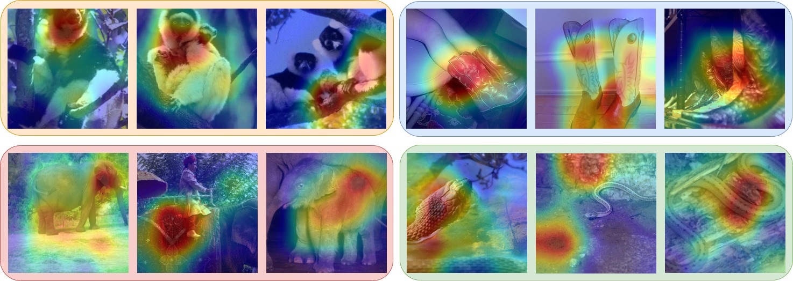

# Feature Space Augmentation for Long Tailed Data

Unofficial implementation for ECCV 2020 paper "Feature Space Augmentation for Long-Tailed Data".


## Getting Started

### Setup Environment

**Installation Requirements**

- Python >= 3.6
- PyTorch >= 1.2

Install python packages in `requirements.txt`.

### Phase-I: Initial Feature Learning

Modify configuration file in  `/configs/phase_i`, and run `phase_i_train_or_test.py` :

```shell
python phase_i_train_or_test.py --config config_name --device GPU_id
```

### Phase-II: Determining Confusing Classes & Calculating Features for Offline Augmentation

Modify configuration file in  `/configs/phase_ii`, and run `phase_ii_extract_feature.py` :

```shell
python phase_ii_extract_feature.py --config config_name --device GPU_id
```

### Phase-III (a.k.a. Phase II in Paper): Fine Tuning with Feature Space Augmentation

Modify configuration file in  `/configs/phase_iii`, and run `phase_iii_online_train_or_test.py` :

```shell
python phase_iii_online_train_or_test.py --config config_name --device GPU_id
```

We also implement offline feature augmentation algorithm, which calculates all training feature vectors in Phase-II and trains in phase-III without updating training samples. Run `phase_iii_offline_train_or_test.py` :

```shell
python phase_iii_offline_train_or_test.py --config config_name --device GPU_id
```

The offline version overfits quickly and does not improve over phase-I baseline.


## Grad-CAM Visualization

To visualize the Grad-CAM heatmap over input images, modify configuration file in  `/configs/phase_ii`, and run `visualize.py` :

```shell
python visualize.py --config config_name --device GPU_id
```

Here is some examples of tail classes from ImageNet-LT:




## Code Structure

    ./
    ├── configs/                            # store experiment configs
    │   ├── phase_i/                        # there are 3 training phase in the paper
    │   │   ├── cifar10-LT_resnet18.yaml    # a training config
    │   │   └── ... 
    │   ├── phase_ii/
    │   │   ├── cifar10-LT_resnet18.yaml    # config for extracting feature map
    │   │   └── ... 
    │   └── phase_iii/
    │   │   ├── cifar10-LT_resnet18.yaml    # a training config
    │   │   └── ... 
    ├── datasets/                           # all datasets
    │   ├── __init__.py                     # include get_dataset()
    │   ├── finetune_dataset.py				# online augmentation dataset for phase III
    │   ├── feature_dataset.py				# offline augmentation dataset for phase III
    │   ├── example.py
    │   ├── cifar_lt.py
    │   └── imagenet_lt.py
    ├── models/                             # all models
    │   ├── __init__.py                     # include get_model()
    │   ├── resnet.py
    │   └── resnet_cifar.py
    ├── utils/                              # Tools and utilities
    ├── checkpoints/                        # save model checkpoints
    │   ├── phase_i/
    │   │   ├── cifar10-LT_resnet18/        # same as current config filename
    │   │   │   ├── note_1/                 # pass to argparser to identify different experiment setting
    │   │   │   │   ├── best_model.pt       # checkpoint with best test acc
    │   │   │   │   ├── model_epoch_0020.pt # checkpoint at epoch 20
    │   │   │   │   └── ... 
    │   │   │   ├── note_2/
    │   │   │   └── ...
    │   │   └── ...
    │   └── phase_iii/
    ├── log/                                # logging files and backup configs, same structure as 
    ├── phase_i_train_or_test.py            # phase I training & test script
    ├── phase_ii_extract_feature.py         # phase II script
    ├── phase_iii_online_train_or_test.py   # phase III online training & test script
    ├── phase_iii_offline_train_or_test.py  # phase III offline training & test script
    ├── run_summary/                        # tensorboard summary, same structure as ./checkpoints
    ├── .gitignore                          
    ├── LICENSE
    ├── requirements.txt                   
    └── README.md

